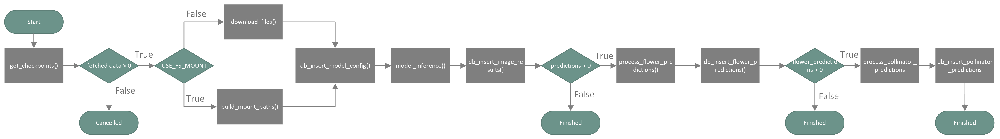

# Mitwelten: pollinator-ml-backend

This projects implements a backend infrastructure which applies an ETL pipeline for the [PollinatorDetection Model](https://github.com/WullT/Pollinatordetection). The pipeline processes data from an s3 bucket and inserts it to a SQL database.

## Installation

Clone repo locally
```bash
git clone git@github.com:mitwelten/pollinator-ml-backend.git
cd pollinator-ml-backend
```

**Note**:
The follow-up instructions are limited to Linux OS. It is not guranteed to work with Windows (particularly nvidia-docker). In my case on Windows OS I installed the Linux subsystem for Windows (Ubuntu 22.04) and it worked fine.

### Docker setup with GPU (recommended)
Make sure nvidia-docker is installed to make use of GPU during yolov5 inference. 

Requirements (according to [yolov5 instructions](https://github.com/ultralytics/yolov5/wiki/Docker-Quickstart)):

- Nvidia Driver >= 455.23 https://www.nvidia.com/Download/index.aspx
- Nvidia-Docker https://github.com/NVIDIA/nvidia-docker
- Docker Engine - CE >= 19.03 https://docs.docker.com/install/

Build from Dockerfile
```bash
docker build . --file Dockerfile --tag pollinator-ml-backend-image
```

Start container
```bash
docker run \
    -it \
    -v $PWD:/root/ \
    --name pollinator-ml-backend \
    --gpus all \
    -p 4200:4200 \
    pollinator-ml-backend-image
```
**Note:** Dependnig on your system sudo privilegues are required. If filesystem mount is chosen as flow parameter, than do not forget to add it as additional Docker volume `-v /mount_path/:/mount_path/`

Inside Container CLI check CUDA version
```bash
nvidia-smi
```
The output should look like this:
```bash
+-----------------------------------------------------------------------------+
| NVIDIA-SMI 520.56.06    Driver Version: 522.30       CUDA Version: 11.8     |
|-------------------------------+----------------------+----------------------+
| GPU  Name        Persistence-M| Bus-Id        Disp.A | Volatile Uncorr. ECC |
| Fan  Temp  Perf  Pwr:Usage/Cap|         Memory-Usage | GPU-Util  Compute M. |
|                               |                      |               MIG M. |
|===============================+======================+======================|
|   0  NVIDIA GeForce ...  On   | 00000000:09:00.0  On |                  N/A |
|  0%   53C    P8    30W / 200W |    980MiB /  8192MiB |      0%      Default |
|                               |                      |                  N/A |
+-------------------------------+----------------------+----------------------+

+-----------------------------------------------------------------------------+
| Processes:                                                                  |
|  GPU   GI   CI        PID   Type   Process name                  GPU Memory |
|        ID   ID                                                   Usage      |
|=============================================================================|
|  No running processes found                                                 |
+-----------------------------------------------------------------------------+
```
Check CUDA functionalities with Pytorch:
```bash
python ./src/scripts/check_torch_cuda.py
```

### Docker setup CPU only

Build from Dockerfile
```bash
docker build . --file Dockerfile --tag pollinator-ml-backend-image
```

Start container
```bash
docker run \
    -it \
    -v $PWD:/root/ \
    -p 4200:4200 \
    --name pollinator-ml-backend \
    pollinator-ml-backend-image
```

### Manual setup with python pip

Setup virtual environment 

```bash
python -m venv env
```

Activate virtual environment
```bash
# Linux
source env/bin/activate

# Windows
env\Scripts\activate
```

Upgrade pip
```bash
pip install --upgrade pip
pip --version
```
Install project specific packages:
```bash
python pip install -r requirements.txt
```
It should be the latest version of pip installed.


Install `Pytorch` according to official instructions: https://pytorch.org/get-started/locally/

Script to check if pytorch was successfully installed and has access to GPU:
```bash
python ./src/scripts/check_torch_cuda.py
```

## Download models

The model weigths are a requirement. If the repo was built with Docker the model weights were installed automatically. Check folder `./src/pipeline/Pollinatordetection/models` if the weights are present.

Download models with this script (needs `gdown` to be installed)
```python
python ./src/scripts/download_models.py
```


## Prefect 2 Deployment

Make sure container is running
```bash
docker run pollinator-ml-backend
```

Enter bash inside of container
```bash
docker exec -it pollinator-ml-backend bash
```

Create deployment file with prefect
```bash
prefect deployment build flow:etl_flow -n pollinator -q pollinator-queue
```
More information and examples on [prefect 2 deployments](https://docs.prefect.io/concepts/deployments/)

Apply deployment
```bash
prefect deployment apply etl_flow-deployment.yaml
```


## Run Locally 
Within container: 

Start user interface (prefect orion)
```bash
prefect orion start --host 0.0.0.0
```
**Note:** In my tests I ran the following two components with separate detached terminals i.e. screen (linux), one for the orion interface and one for the queue.

Start working queue
```bash
prefect agent start --work-queue "pollinator-queue"
```
Everything should be controllable by the orion UI, where schedules and jobs can be applied. The working queue is listening to the deployment and runs jobs as soon as they are scheduled.

## Pipeline



## Authors

- [@simsta1](https://www.github.com/https://github.com/simsta1)
- [@WullT](https://github.com/WullT)

## Resources

https://github.com/WullT/Pollinatordetection

https://github.com/ultralytics/yolov5

https://docs.prefect.io/
